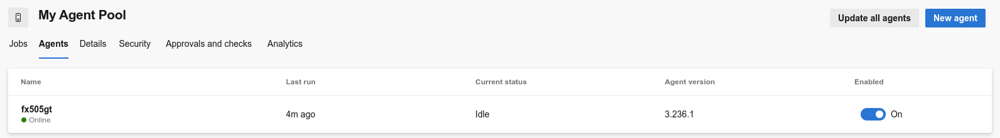
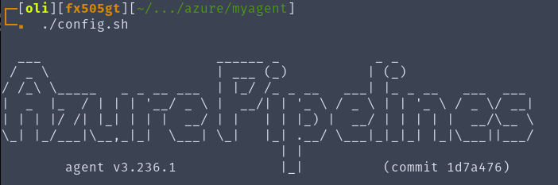
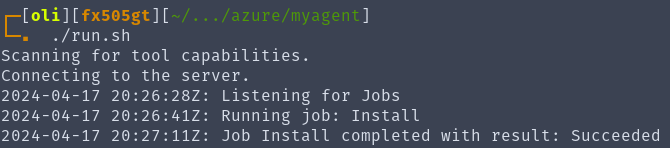
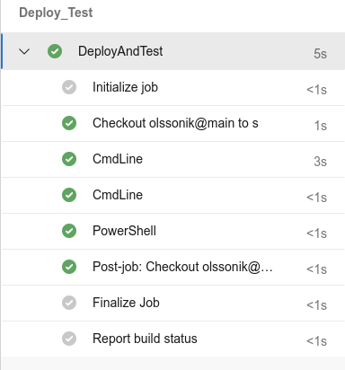
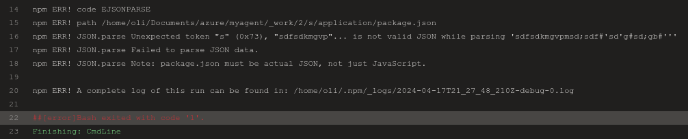
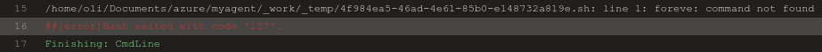
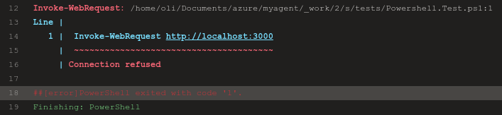

# Agent setup 🕵️‍♂️

- Add an agent to the pool (In my case the agent is ruuning in ubuntu) 
   
- Configure a self hosted agent 
  
   

# Pipeline 🚀

My pipeline stored in _[YAML file](azure-pipelines.yml)_ :

- Starts on commit to main branch of the repository

- Installs dependencies

- Starts the application

- Runs a _[PowerShell script](tests/Powershell.Test.ps1)_ which tests the connection with the deployed application.

# Cases of Failure ⛔

Theese are examples of why the jobs might fail:

- Failure while installing the dependencies 

 
 

- Failure while starting the application 

 
 

- Failure While running the PowerShell script 

 
 
